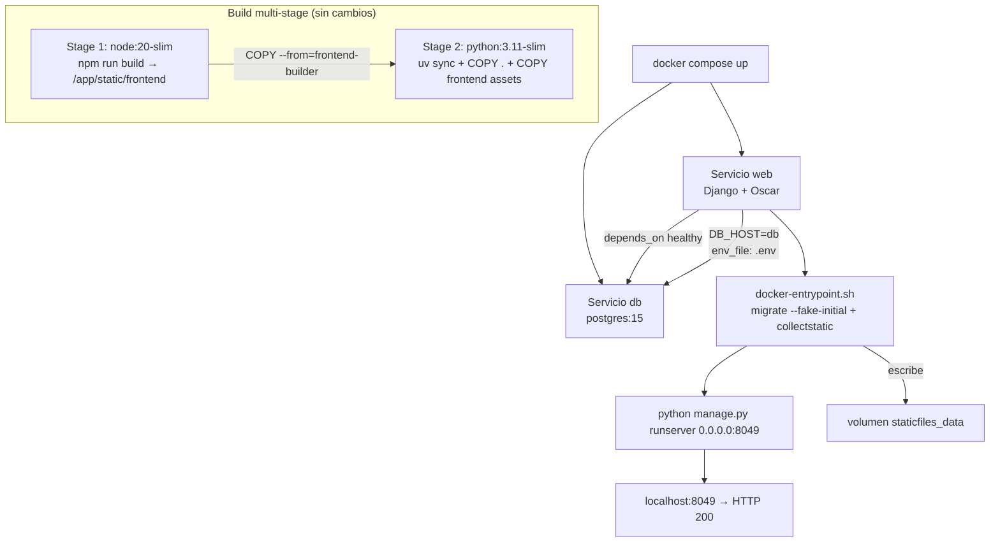

# Resumen

### Objetivo
Aplicar las correcciones necesarias en los archivos de configuración Docker para que el proyecto de pizzería (Django + Oscar + PostgreSQL + frontend Vite/React) arranque correctamente en **cualquier entorno** con un simple `docker compose up`, sin ningún paso manual adicional.

### Alcance
**Incluido:**
- Corregir `docker-entrypoint.sh` para que `migrate` no falle cuando el volumen `postgres_data` ya tiene las tablas de una ejecución anterior.
- Corregir `docker-compose.yml` para que todas las variables del `.env` lleguen al contenedor `web` automáticamente.
- Eliminar el volumen bind-mount (`- .:/app`) del servicio `web` para que el código compilado dentro de la imagen no sea sobreescrito por el directorio local.
- Verificar que con `docker compose up` solo, los contenedores arrancan, migran y sirven tráfico HTTP 200.

**Excluido:**
- Configuración de producción (Gunicorn, Nginx, HTTPS).
- Carga de fixtures o datos de prueba en la base de datos.
- Cambios en `settings.py` o en el código de la aplicación.

# Correcciones

### Análisis del estado actual

#### ✅ Correcto — no requiere cambios
- `vite.config.ts` ya tiene `outDir: path.resolve(__dirname, '../static/frontend')` → coincide con `COPY --from=frontend-builder /app/static/frontend` del `Dockerfile`.
- `docker-compose.yml` ya pasa `DB_HOST=db` explícitamente, sobrescribiendo el valor local del `.env`.
- El healthcheck de `db` y el `depends_on: condition: service_healthy` ya previenen arranques prematuros.

---

#### ❌ Problema 1 — Error en el log `web-1`: `migrate` falla al reiniciar (tablas ya existentes)

> ⚠️ **Este es el error que apareció en el log:**
> ```
> django.db.utils.ProgrammingError: relation "checkout_pendingmercadopagopayment" already exists
> ```

- Cuando el contenedor `web` reinicia, `docker-entrypoint.sh` ejecuta `migrate --noinput` de nuevo.
- Si el volumen `postgres_data` ya tiene las tablas físicas pero la tabla `django_migrations` no registra algunas migraciones (p. ej. porque el contenedor se interrumpió durante el primer arranque), Django intenta `CREATE TABLE` sobre tablas existentes y falla.
- **Corrección:** agregar el flag `--fake-initial` al comando migrate. Este flag detecta automáticamente si las tablas de una migración inicial ya existen y las marca como aplicadas sin intentar crearlas de nuevo.

```bash
# ANTES (docker-entrypoint.sh)
python manage.py migrate --noinput

# DESPUÉS
python manage.py migrate --noinput --fake-initial
```

---

#### ❌ Problema 2 — Variables del `.env` no llegan al contenedor `web`
- Variables como `EMAIL_HOST_USER`, `MERCADOPAGO_ACCESS_TOKEN`, `DJANGO_SECRET_KEY`, `DB_PASSWORD`, etc. están en `.env` pero **no se pasan al contenedor** `web`.
- Docker Compose lee `.env` automáticamente para interpolar `${VAR}` en el YAML, pero no lo inyecta dentro del contenedor a menos que se use `env_file:`.
- Docker Compose respeta la precedencia: `environment:` tiene **mayor prioridad** que `env_file:`, por lo que agregar `env_file: - .env` no sobreescribirá `DB_HOST=db`.
- **Corrección:** agregar `env_file: - .env` al servicio `web` en `docker-compose.yml`.

---

#### ❌ Problema 3 — Volumen bind-mount `- .:/app` sobreescribe el código compilado
- El volumen `- .:/app` monta el directorio local sobre `/app` dentro del contenedor, pisando el código y assets compilados en la imagen.
- El volumen anónimo `/app/static/frontend` intenta proteger los assets, pero no es confiable en entornos donde el directorio local no tiene esa carpeta.
- **Corrección:** eliminar los tres volúmenes del servicio `web` y agregar un volumen nombrado `staticfiles_data:/app/staticfiles` para persistir los archivos de `collectstatic`.

# Diseño Técnico

### Arquitectura Docker (después de correcciones)



### Cambio 1: `docker-entrypoint.sh` — fix del error `relation already exists`

**Antes:**
```bash
echo "Running migrations..."
python manage.py migrate --noinput
```

**Después:**
```bash
echo "Running migrations..."
python manage.py migrate --noinput --fake-initial
```

> **Por qué funciona:** `--fake-initial` detecta si las tablas de una migración `initial=True` ya existen en la base de datos. Si existen, marca la migración como aplicada en `django_migrations` sin ejecutar el DDL, evitando el error `relation already exists`. Las migraciones posteriores (no iniciales) se aplican normalmente.

### Cambio 2: `docker-compose.yml` — env_file y volúmenes

**Antes:**
```yaml
  web:
    build: .
    volumes:
      - .:/app
      - /app/.venv
      - /app/static/frontend
    ports:
      - "8049:8049"
    environment:
      - DJANGO_SECRET_KEY=${DJANGO_SECRET_KEY:-django-insecure-default-change-me-in-production}
      - DJANGO_DEBUG=${DJANGO_DEBUG:-True}
      - DJANGO_SECURE_SSL_REDIRECT=${DJANGO_SECURE_SSL_REDIRECT:-False}
      - DB_NAME=${DB_NAME:-pizzeria_db}
      - DB_USER=${DB_USER:-postgres}
      - DB_PASSWORD=${DB_PASSWORD:-1234j}
      - DB_HOST=db
      - DB_PORT=5432
```

**Después:**
```yaml
  web:
    build: .
    env_file:
      - .env
    volumes:
      - staticfiles_data:/app/staticfiles
    ports:
      - "8049:8049"
    environment:
      - DB_HOST=db          # sobreescribe DB_HOST=localhost del .env
      - DB_PORT=5432

volumes:
  postgres_data:
  staticfiles_data:
```

### Archivos modificados

 Archivo | Cambio |
---|---|
 `docker-entrypoint.sh` | Agregar flag `--fake-initial` al comando `migrate` |
 `docker-compose.yml` | Agregar `env_file: - .env`; reemplazar volúmenes; agregar volumen nombrado `staticfiles_data`; simplificar bloque `environment:` |

### Archivos sin cambios

 Archivo | Estado |
---|---|
 `Dockerfile` | ✅ Correcto |
 `config/settings.py` | ✅ Correcto |
 `frontend/vite.config.ts` | ✅ Correcto |
 `.dockerignore` | ✅ Correcto |

# Validación

### Pasos de verificación

1. **Build de la imagen** — `docker compose build --no-cache` sin errores.
2. **Levantar servicios** — `docker compose up -d` (sin flags adicionales).
3. **Verificar `db` healthy** — `docker compose ps` muestra `db (healthy)`.
4. **Verificar logs de `web`** — `docker compose logs web` muestra `migrate` ✅, `collectstatic` ✅, `runserver` ✅, sin `ProgrammingError`.
5. **Reinicio del contenedor** — `docker compose restart web` y verificar que los logs **no** contienen `ProgrammingError` ni `relation already exists`.
6. **Prueba HTTP** — `curl -s -o /dev/null -w "%{http_code}" http://localhost:8049/` retorna `200`.
7. **Verificar assets estáticos** — `curl -s -o /dev/null -w "%{http_code}" http://localhost:8049/static/frontend/manifest.json` retorna `200`.

### Criterios de éxito
- Imagen se construye con `docker compose build` sin `--env-file`.
- Ambos contenedores arrancan con `docker compose up` sin argumentos extras.
- `web` ejecuta migraciones y collectstatic sin errores en los logs.
- El contenedor `web` puede reiniciarse **sin** error `relation already exists`.
- HTTP 200 en `http://localhost:8049`.
- No hay `DisallowedHost`, `OperationalError` ni `ProgrammingError` en logs.

# Delivery Steps

###   Step 1: Corregir docker-entrypoint.sh — fix del error 'relation already exists'
El entrypoint usa `migrate --noinput --fake-initial` para que el contenedor pueda reiniciarse sin fallar cuando las tablas ya existen en el volumen de la base de datos.

- **Este paso resuelve directamente el error del log:**
  ```
  django.db.utils.ProgrammingError: relation "checkout_pendingmercadopagopayment" already exists
  ```
- En `docker-entrypoint.sh`, cambiar `python manage.py migrate --noinput` por `python manage.py migrate --noinput --fake-initial`.
- El error ocurre porque el volumen `postgres_data` ya tiene tablas físicas de una ejecución anterior, pero `django_migrations` no tiene registradas esas migraciones — Django intenta `CREATE TABLE` sobre tablas que ya existen.
- `--fake-initial` detecta ese caso y marca las migraciones iniciales como aplicadas sin ejecutar el DDL. Las migraciones incrementales posteriores se aplican normalmente.

###   Step 2: Corregir docker-compose.yml — env_file y volúmenes del servicio web
El `docker-compose.yml` queda configurado para inyectar todas las variables del `.env` en el contenedor `web` y sin bind-mount que sobreescriba el código compilado de la imagen.

- Agregar `env_file: - .env` al servicio `web` para que variables como `DJANGO_SECRET_KEY`, `DB_PASSWORD`, `MERCADOPAGO_ACCESS_TOKEN`, `EMAIL_HOST_USER`, etc. estén disponibles dentro del contenedor automáticamente.
- Eliminar los tres volúmenes del servicio `web` (`- .:/app`, `- /app/.venv`, `- /app/static/frontend`) que provocan que el directorio local sobrescriba el código compilado de la imagen.
- Reemplazarlos por un único volumen nombrado `staticfiles_data:/app/staticfiles` para persistir los archivos generados por `collectstatic`.
- Simplificar la sección `environment:` del servicio `web` para que solo contenga `DB_HOST=db` y `DB_PORT=5432` (las demás variables llegan vía `env_file:`, y estas dos sobreescriben los valores del `.env` gracias a la precedencia de `environment:`).
- Declarar el nuevo volumen `staticfiles_data` en la sección raíz `volumes:`.

###   Step 3: Construir la imagen y verificar el arranque completo
Ambos contenedores arrancan correctamente con `docker compose up` sin argumentos adicionales, el servidor responde HTTP 200 y el contenedor puede reiniciarse sin errores.

- Ejecutar `docker compose build --no-cache` y confirmar que los stages `frontend-builder` y Python completan sin errores.
- Ejecutar `docker compose up -d` (sin `--env-file` ni otros flags).
- Verificar con `docker compose ps` que `db` está `healthy` y `web` está `running`.
- Revisar `docker compose logs web`: sin `ProgrammingError`, con `Running migrations...` ✅, `Collecting static files...` ✅, `Starting development server at http://0.0.0.0:8049/` ✅.
- Ejecutar `docker compose restart web` y confirmar que los logs **no** contienen `relation already exists`.
- Confirmar HTTP 200 en `http://localhost:8049/`.
- Confirmar HTTP 200 en `http://localhost:8049/static/frontend/manifest.json`.